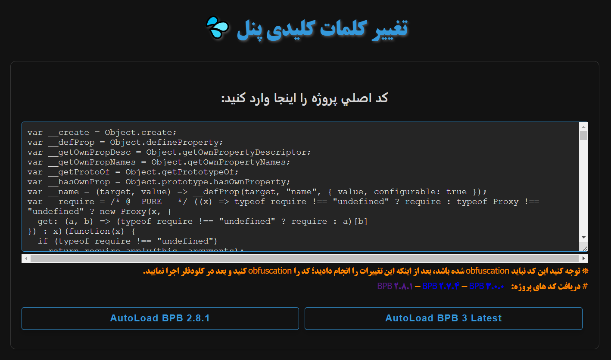
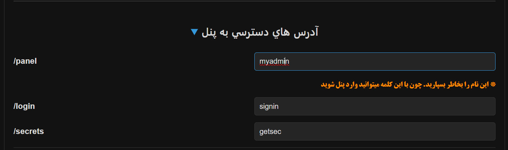
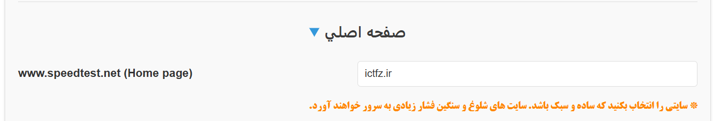
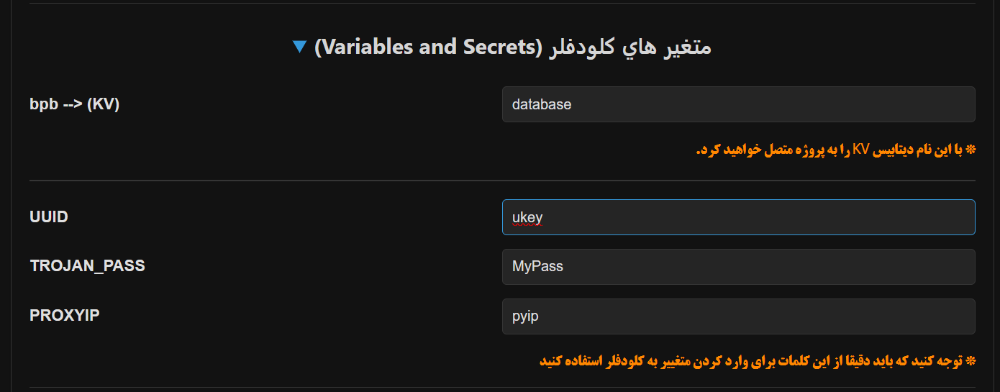
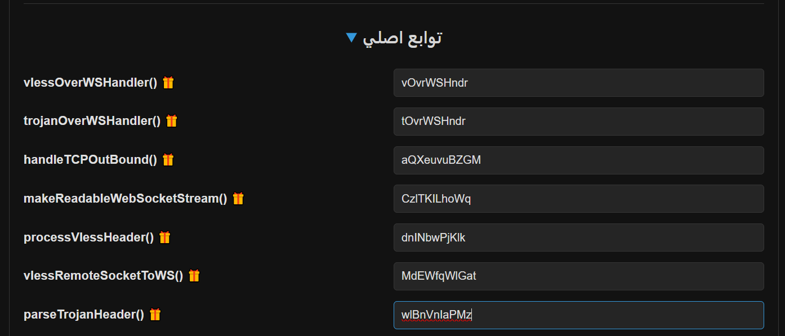
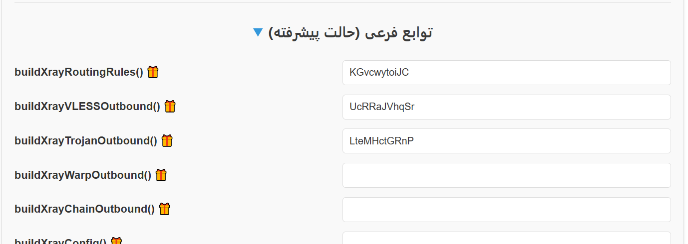
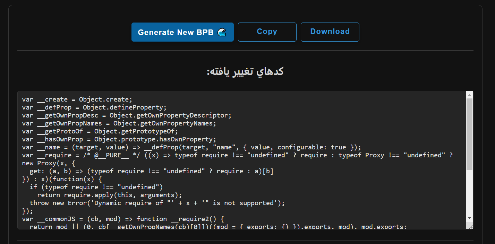
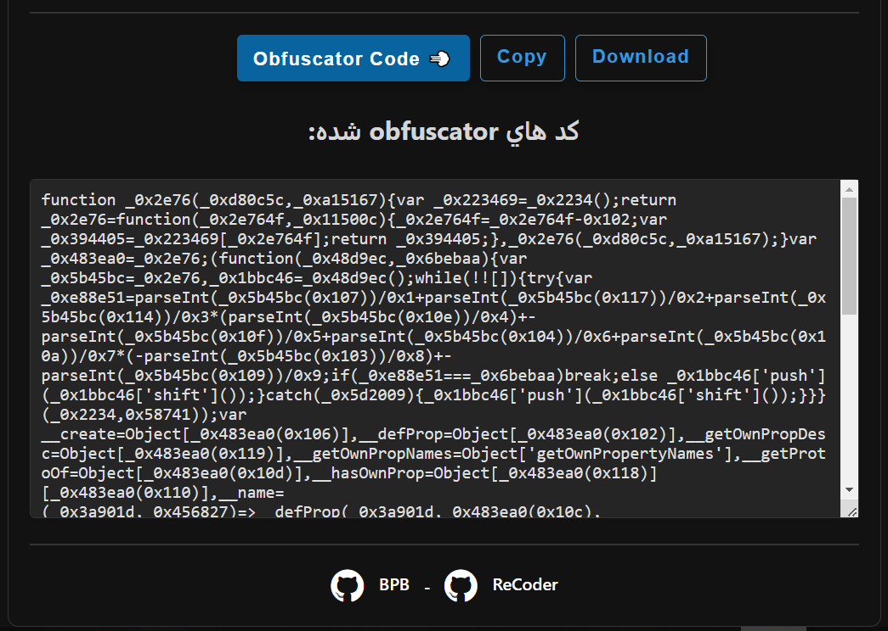

    
<h1 align="center">😎 شخصی سازی 
    <a href="https://github.com/bia-pain-bache/BPB-Worker-Panel">پنل BPB 💦</a> 
</h1>
<h2 align="center">پشتیبانی تا BPB v3.1.4</h2>

[**English**](https://liMilCo.github.io/BPB-ReCoder/README_en)   -   [فارسی](https://liMilCo.github.io/BPB-ReCoder)

---

* Ad: **پروژه ای مشابه**
  * [Free-Internet 🐉](https://github.com/liMilCo/Free-Internet): (ساده ترین و سبک ترین پروژه پروکسی بر روی کلودفلر ورکر)
  * [Tunneling Through 🗽](https://github.com/liMilCo/Free-Internet#tunneling-through): (تونل کردن کلودفلر برای سرورهای فیلتر شده و کانفیگ های رایگان و ایجاد ای-پی ثابت)

---
# راهنما

😎 به وسیله این برنامه:

  <a href="https://liMilCo.github.io/BPB-ReCoder/recoder.html">https://liMilCo.github.io/BPB-ReCoder/recoder.html</a>
   
<!-- 
  یا
   
  <a href="https://raw.githack.com/liMilCo/BPB-ReCoder/main/recoder.html">https://raw.githack.com/liMilCo/BPB-ReCoder/main/recoder.html</a>
 -->
    
  

  

شما می توانید کد های پلن را شخصی سازی کنید، همچنین از بن شدن و ارور 1011 جلوگیری کنید.
      
از انجا که کلودفلر با برسی کد ها، پروژه را شناسایی و بن میکند برای جلوگیری از ارور 1011 باید کلمات کلیدی مانند نام توابع، آدرس دسترسی به پنل و داده های متغیر و دیتابیس KV تغییر داده شود. این برنامه بسادگی این کار را برای شما انجام خواهد داد.

## اول

<a href="https://liMilCo.github.io/BPB-ReCoder/recoder.html" target="_blank">از اینجا وارد نرم افزار آنلاین شوید ...</a>

### کد های اصلی و خام پروژه BPB را در باکس اول وارد کنید:

<h3>دریافت کد های پروژه: 
    <a href="https://github.com/bia-pain-bache/BPB-Worker-Panel/releases" target="_blank">💦 BPB Panel</a>
</h3>

## دوم

### وارد کردن اطلاعات ورود به پنل (اجباری 😱)

📝 فقط از کلمات کوچک انگیسی

**باکس هایی که باز هستند وارد کردن اطلاعات اجباری می باشد و باکس هایی که پیشفرض بسته هستند مثل (صفحه اصلي) یا (توابع فرعي) میتوانید خالی بگزارید**

توجه کنید وقتی پروژه شخصی سازی شده خود را در گیتهاب اجرا میکنید برای دسترسی به پنل بجای کلمه `panel` در آدرس

`BPB.SUB.workers.dev/panel`

باید از کلمه ای که در اینجا استفاده کرده اید استفاده کنید (مثلا در اینجا ما `myadmin` را انتخاب کرده ایم پس با این آدرس وارد پنل خواهیم شد:

`BPB.SUB.workers.dev/myadmin`

### انتخاب یک سایت برای صفحه اول یا روت برنامه (اختیاری😴)
این سایت پیشفرض speedtest کلودفلر هست و وارد کردن آن اختیاریست و میتوانید آن را خالی بگزارید
اگر خواستید یک آدرس انتخاب کنید اول مطمعن شوید که املای کلمات را کاملا درست وارد کنید و سایتی را انتخاب کنید که سبک و ساده باشد وگرنه تعداد درخواست های زیاد به سرور کلودفلر فشار وارد میکند.

### وارد کردن اطلاعات مربوط به دیتابیس KV و متغیر های کلودفلر: (اجباری 😱)

همان طور که در آموزش های پنل خوانده اید برای اتصال دیتابیس باید بعد از ساخت KV حتمی باید ان را با نام bpb به پنل معرفی نمایید، در اینجا شما باید این نام را تغییر دهید.

📝 نام دیتابیس KV فقط از کلمات کوچک انگیسی

همچنین کلمات UUID و TROJAN_PASS و PROXYIP که آنها را در `Settings` بخش `Variables and Secrets`  وارد میکردید، باید تغییر دهید و آن ها را بخاطر بسپارید زیرا این کلمات با دقت باید در کلودفلر ثبت شوند.

📝 نام متغیرها فقط از کلمات کوچک و بزرگ انگیسی

مطابق مثال :

### دقت کنید که حروف بزرگ و کوچک انگلیسی مهم هست و باید دقیقا همان کلمه وارد شود

**👈 این کلمات بعد از یک بار اجرای کد در مرورگر ذخیره میشوند ولی بهتر است آنها را در یک جا یاداشت کنید 👉**

### تغییر نام توابع در پروژه (توصیه می شود 😎)
👈 نام همه توابع به صورت خودکار داده دهی میشوند. 👉

📝 فقط از کلمات انگیسی (کوچک یا بزرگ) و حداقل 5 کاراکتر

برای راحتی کار شما میتوانید با کلیک بر روی 🎁 یک نام شانسی برای این توابع انتخاب کنید.

### حالت پیشرفته تغییر توابع (توصیه می شود 😎)

## سوم

برای ایجاد تغییرات دکمه  `Generate New BPB 🌊` را فشار دهید
در باکس مربوطه کد های تغییر کرده را نمایش میدهد که میتوانید ان را دانلود کنید

## چهارم 
بعد از ایجاد تغییرات با دکمه `Obfuscator Code 💨` میتوانید در همین صفحه کد ها را Obfuscator کنید
بعد انها را کپی کرده در workers پیست کنید یا دانلود کرده بعد از فشرده سازی (zip کردن) آن را در pages آپلود کنید.

## Project View

## Stargazers over time

 

